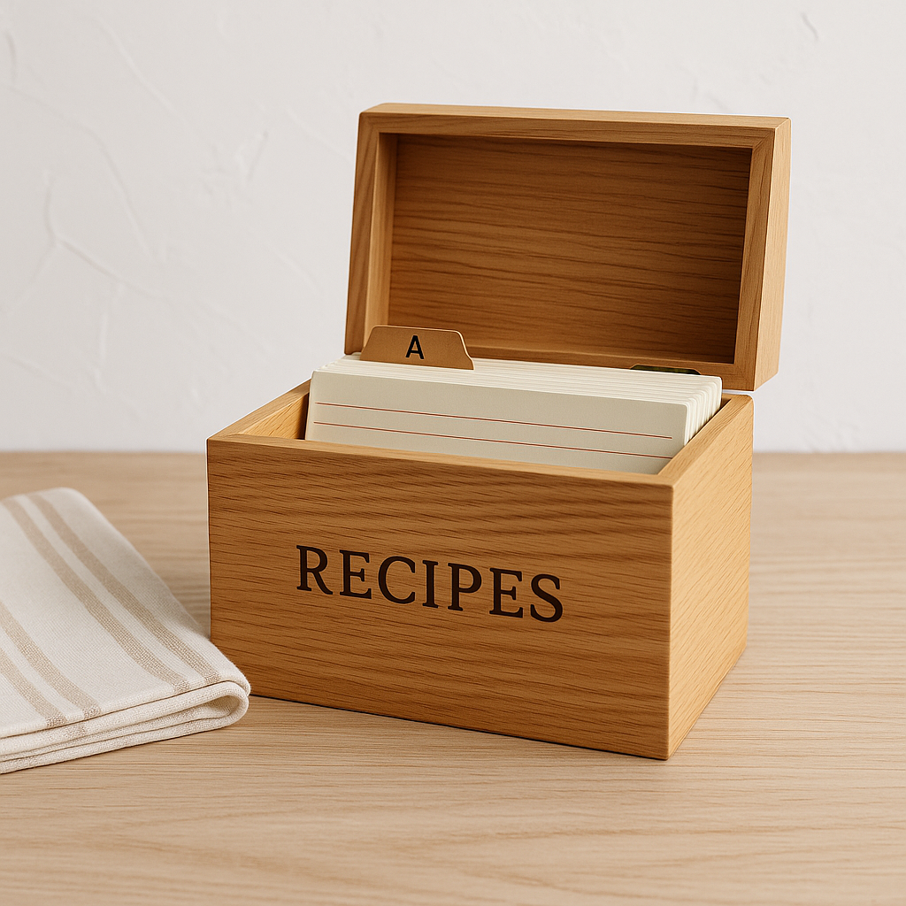
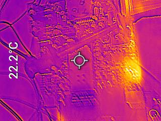
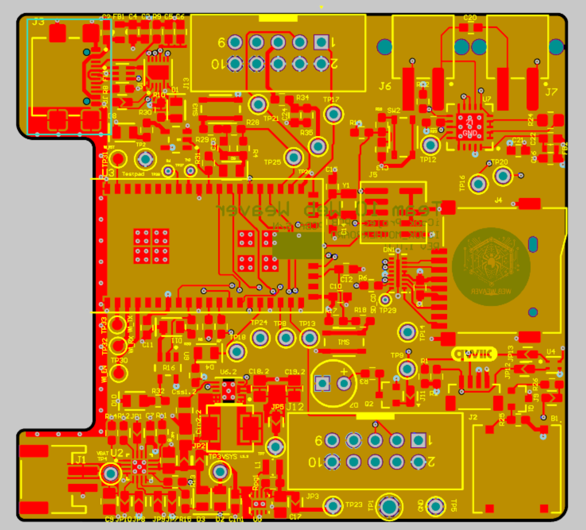
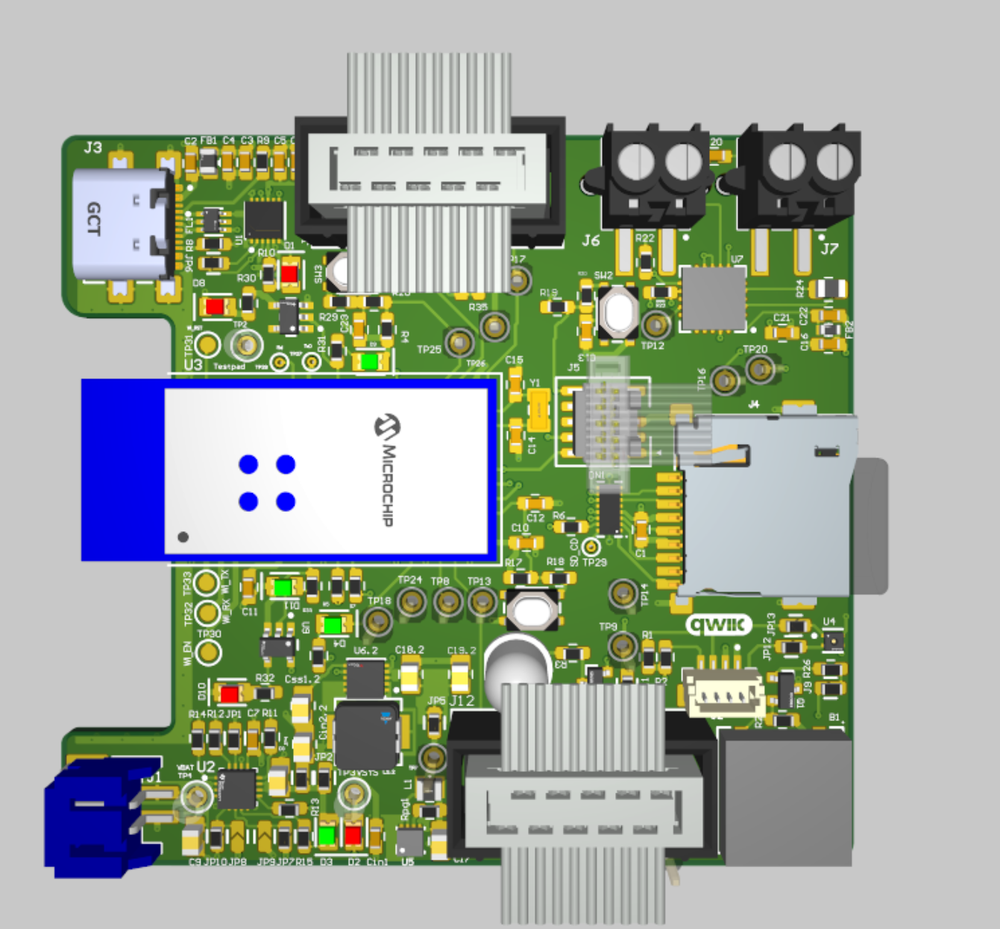

# a14g-final-submission

    * Team Number: 10
    * Team Name: Web Weaver
    * Team Members: Zhiye Zhang, Yunlong Han
    * Github Repository URL: https://github.com/ese5160/a14g-final-submission-s25-t10-web-weaver
    * Description of test hardware: laptop, our costum PCBA, Sensors and actuators

## 1. Video Presentation

## 2. Project Summary

### Device Description

- Our device is designed to help freshman in kitchen, giving step by step instruction on cooking while prevent them from messing up. It is a modern state-of-art digital recipe box which have a fancy interface and sensitive monitoring system.

- Our project inspiration comes from our daily life. When I am a graduate student, I live outside the school and have to cool myself everyday. However, I nearly never cooked before so I messed up several times. And then I bought a recipe box from amazon.

  

  So we have that great idea. Would it be better if we can access to recipe for different steps of cooking more easily? And if there is a monitoring system, you will get alarmed before you notice you messed up. 

- We used Internet to build a online monitoring system so that you can access the sensor measurement  from other device such as your mobile phone. Meanwhile, we also made a online update system which can update the firmware image from cloud server so we don't have to flash to code locally every time we have some update.

### Device Functionality

- To design our device, we analyzed the users needs step by step. For a good recipe box, we need to give the user the ingredients need while cooking, and give our step by step instruction while cooking. To do this, we used a 7'' screen (which is larger than normal phone) to have a user friendly interface, we also have a joystick and button for user the switch between stages. To prevent user from messing up cooking, we build a monitoring system to measure the kitchen temperature and humidity as well as the food temperature while you are cooking. In that case, the user will get alarmed before the food is overcooked or the kitchen is filled with steam, so that there is still time for user to make it right.

- Our device have sensor to build a monitoring system.

  ​	SHT 45 temperature and humidity sensor

  ​	PT1000 RTD sensor

​	We also have actuator to build a user friendly interface.

​		7.0" 40-pin TFT Display

​	Besides, we have other critical component for user to operate.

​		Joystick

​		Button

- System-level block diagram

### Challenges

We faced a lot of challenges in every stages of our design.

#### Hardware

1. We have a a problem in pin mapping. Because we almost use up all available pin in our MCU. To solve this, we tried several pinmux on Atmel start and finally figured out the available pin mapping.
2. In our PCB design, we have many component in our PCB while the PCB area is strictly  limited. To solve this, we have several rework to find out the tightest placement and routing.

#### Software

1. When developing SPI driver code for RA8875 LCD driver and MAX31865 Temperature sensor, we found that the official driver code is written in C++, to convert this to C and to be compatible with our Atmel Advance software framework, we analyzed the functionality of each function and rewrite it in C under ASF (advance software framework) to achieve the same functionality. Meanwhile, we use logic analyzer to analyze the official driver running in Arduino UNO as a golden protocol to debug  the code we wrote running in SAMW25 Xplain pro dev board.

#### Integration

1. In our Device integration, we notice that we made a mistake about cs pin in SPI Serial communication. To solve this, we reused other gpio pins as cs pins and use pull-up and pull-down as end and start of the transition.
2. One of the LED pin cannot be control by gpio, we think it is the manufacturer issue that connect that trace to 3.3V. We have no choice but to give it up.

#### Firmware

1.  When we are developing firmware for our project, we found that we cannot access SD card in other thread. To solve this, we use inter-thread communication to transfer request and respond between the UI task and the Wi-Fi task so that we can access files in SD card.

### Prototype Learnings

1. Things might go out of expectations, so be sure there is always a backup plan so that the project won't failed. In our project, in the beginning, we assume the cs (chip select) Pin is not required since there is only one slave device in one SPI communication bus. However,  when we first test our peripheral devices, we found that it use the cs pin as the start and end of the transition, which make cs pin unreplaceable. Luckily, we have several gpio pin that can be reassign as cs pin for these SPI device. So it is important to have a backup plan.
2. Prepare a golden image for everything. This is really important in debugging because you need to know what is correct. In our firmware driver development, we first get the official driver code from the product site and run it on Arduino UNO, make sure the device is running properly. Then use the logic analyzer to analyze the protocol, so that we can get a correct communication capture. We can use these as reference to build our own driver.

### Next Steps & Takeaways

#### Next Steps

- For demo purpose, we only have 3 simple recipe. As there is much more available space in SD card, we should be able to add more recipes and categorize recipes based on ingredient type.
- We can add more software function to our project. For example, a cooking timer is helpful to control the time of each step.
- There is also a lot more improvement we can do in our Internet. For example, we can use it to manage the file in SD card, like creating and managing recipes and so on.

#### Takeaways

This course really taught us a lot of thing about realizing a IOT device, it went through the entire process of IoT design, which includes,

1.  High-level architecture design
2.  Device selection and pick up (which include reading the datasheet of the component to find the most suitable component)
3.  Schematic design and best practice of it
4.  PCB design and the best practice of it
5.  Using debugger and Serial communication in software development
6.  Use FreeRTOS to develop our project
7. Use cloud server and node-red to do the Internet connection

### Project Links

#### Node-RED instance

Link: http://135.18.249.92:1880/ui/

#### Final PCBA

Link: https://upenn-eselabs.365.altium.com/designs/46A4C42E-CAF3-49DD-92A3-5E922EC2AFCF#design

## 3. Hardware & Software Requirements

### HRS

**HRS 01** - The project shall be based on SAMW25

**HRS 02** - The project shall have 1 SHT45 temperature and humidity sensor, 1 PT1000 RTD temperature probe, 1 LCD screen, 1 Wi-Fi Module, one joystick and one button.

**HRS 03** - The project shall use a joy stick to switch between different recipe

**HRS 04** - The project shall have a SD card for storage purpose

**HRS 05** - The project shall display a main user menu on LCD screen

**HRS 06** - The project shall have some LED indications to indication the system status

**HRS 07** - The project shall use LiPo battery as power source together with boost circuit for 5V supply and buck circuit for 3.3V supply

### SRS

**SRS 01** - There shall be a return on every screen to return to the main menu at any time.

**SRS 02** - There shall be a menu to hold the specific recipe.

**SRS 03** - The first page of recipe shall show the recipe title and ingredients. .

**SRS 04** - The cooking instruction page shall have what to do in the current step, a temperature display, and the sensor data in real time.

**SRS 05** - The should be a value display of the kitchen temperature and humidity at every screen.

## 4. Project Photos & Screenshots

### Final project

### Standalone PCBA

#### Top View

#### Bottom View

### Thermal Image

### Altium Board Desgin

#### 2D

#### 3D

### Node-RED

#### Dashboard

#### Backened

### Block diagram

## Codebase

- A link to your final embedded C firmware codebases

  https://github.com/ese5160/final-project-a07g-a14g-t10-web-weaver

- A link to your Node-RED dashboard code

- Links to any other software required for the functionality of your device

